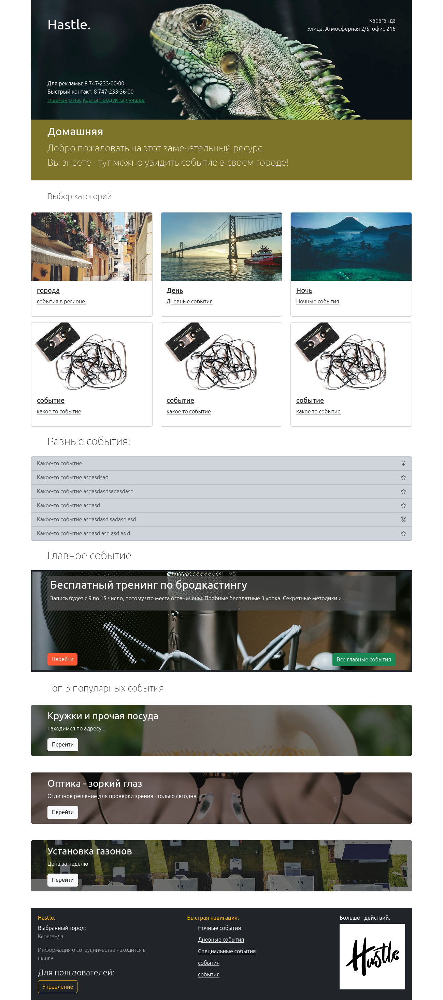

# Hastle.com - events everyday

Simple project in naive PHP.

## Описание

Здесь простой роутинг — смотри файл `composer.json` для большего понимания и загружаемых модулей.

Довольно просто составлена реализация **миграций**. Для простоты, но существует множество способов её реализации. Я сделаю автоматизацию, хотя было бы лучше, если бы это была команда в командной строке.

## Миграции

Файл, контролирующий миграции, находится в директории `Core`. Он создаёт таблицу, которая следит за миграциями и создаёт таблицы, если их нет.

За таблицу миграций отвечает метод `createMigrationTable()`. Всё остальное, я думаю, интуитивно понятно.

## Примечания

Да, конечно, в проекте много пробелов, но я попытался создать основу и продолжаю развивать его каждый день. Главное — это суть проекта с концепцией и архитектурой.

## Пример (еще как видите пилится) сайта
